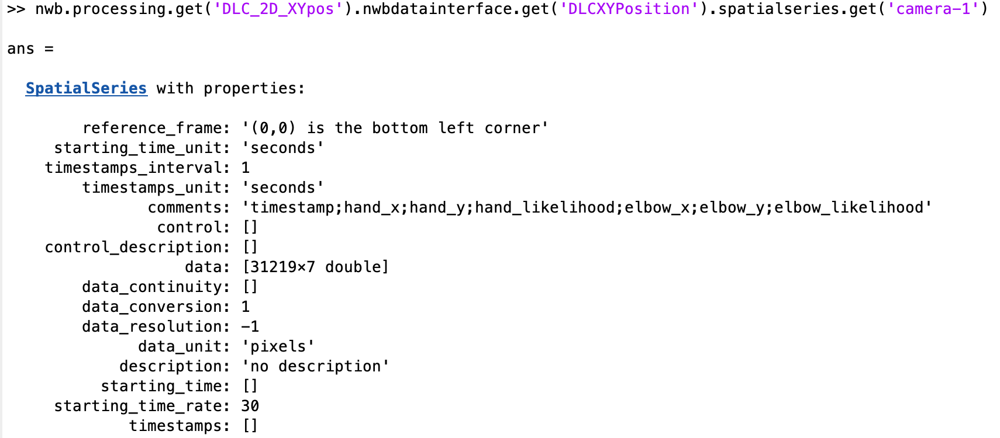

-------------------
Deep Lab Cut System
-------------------

Structure of Deep Lab Cut System
-----------------------------------

Input File is required for storing processed DLC data into NWB Structure
"""""""""""""""""""""""""""""""""""""""""""""""""""""""""

+---------------+---------------------------------------------------------------------+
|      File     |                       Description                                   |
+===============+=====================================================+===============+
|               | Processed DLC data in csv format                                    |
|  ``*``.csv    |                                                                     |
|               | Can be read with function readcell() and readtable() in matlab      |
+---------------+---------------------------------------------------------------------+

NWB Structure Storing processed Deep Lab Cut Data
------------------------------------------

Processed DLC data in ``*``.csv file
"""""""""""""""""""""""""""""""""""""""""""

Processed DLC XY position data are stored as a SpatialSeries structure inside a set of spatialseries at:

``nwb.processing.get('DLC_2D_XYpos').nwbdatainterface.get('DLCXYPosition').spatialseries``

In order to get the spatialseries object containing processed dlc data from camera-1 from this recording, use the command below:

Notes:

* spatialseries.comments: 
          Data Type: character
	Appropriate column names for DLC XY position data delimited with ``;``

* spatialseries.data: 
          Data Type: Double Array
	x, y, likelihood data for all joints across all timestamps
          
* spatialseries.starting_time_rate:
          Data Type: Double
        Number of timestamps recorded in one second
          

