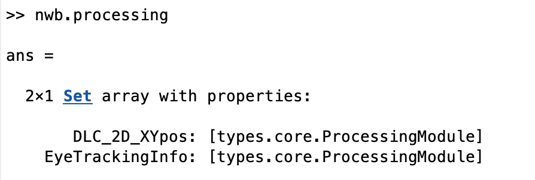
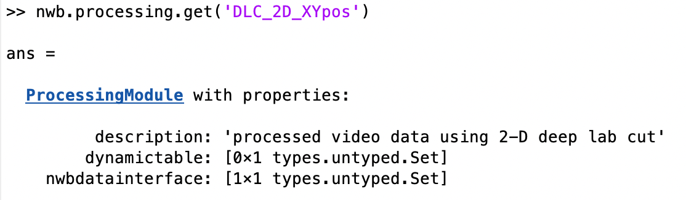
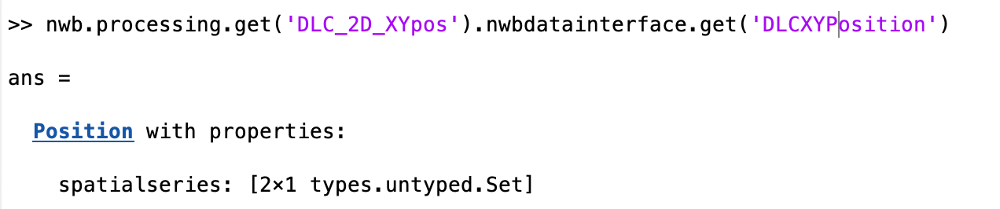
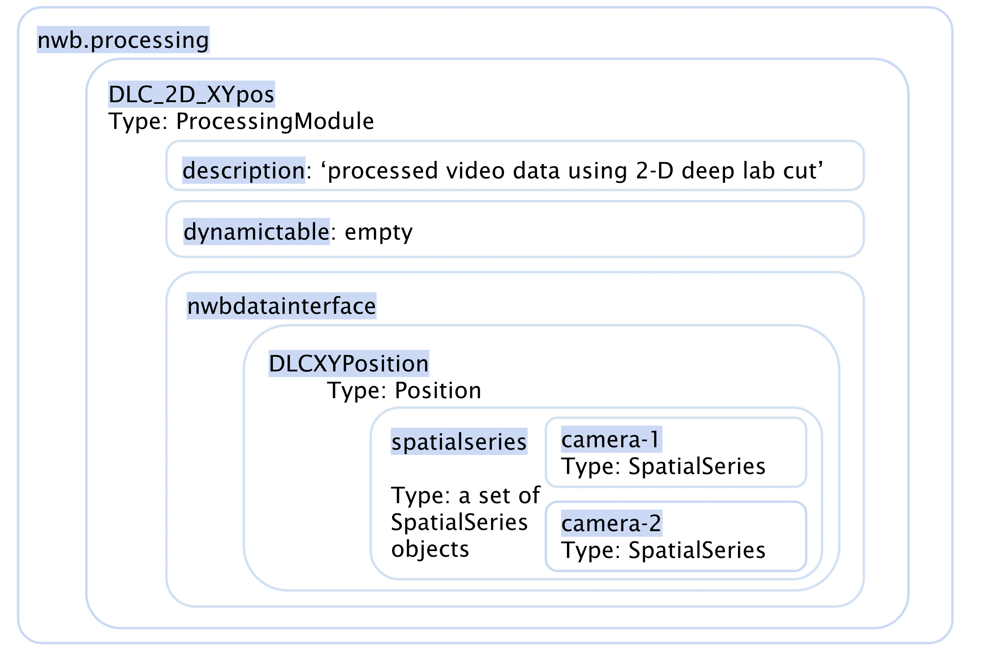

-------------------
Deep Lab Cut System
-------------------

Structure of Deep Lab Cut System
-----------------------------------

Input File is required for storing processed DLC data into NWB Structure
"""""""""""""""""""""""""""""""""""""""""""""""""""""""""

+---------------+-----------------------------------------------------------------------------------------------------------------------+
|      File     |                       Description                                   							|
+===============+=======================================================================================================+===============+
|               | Processed DLC data in csv format                                   							|
|  ``*``.csv    |                                                                     							|
|               | Can be read with function readcell() and readtable() in matlab      							|
|               | 			      			                      							|
|		| Example file's name: v-20220606-130339-camera-1DLC_resnet50_DLC-GoNogo-Set10-camera1Jun22shuffle1_30000.csv		|	
+---------------+-----------------------------------------------------------------------------------------------------------------------+

NWB Structure Storing processed Deep Lab Cut Data
------------------------------------------

Layer1:
++++++++++

Processed Deep Lab Cut data, along with other types of data, are stored inside nwb.processing:
``nwb.processing``

Layer2:
++++++++++

The ProcessingModule inside nwb.processing named DLC_2D_XYpos is where we stored processed deep lab cut data.
You can find a description and a nwbdatainterface for it inside.
``nwb.processing.get('DLC_2D_XYpos')``

Layer3:
++++++++++

``nwb.processing.get('DLC_2D_XYpos').nwbdatainterface``

.. image:: figures/systemdlc_layer3.png

Layer4:
++++++++++

This Position object contains a set of spatialseries objects.
``nwb.processing.get('DLC_2D_XYpos').nwbdatainterface.get('DLCXYPosition')``

Layer5:
++++++++++

Get the set of spatialseries objects with the command below.
``nwb.processing.get('DLC_2D_XYpos').nwbdatainterface.get('DLCXYPosition').spatialseries``

.. image:: figures/systemdlc_layer5.png

Layer6:
++++++++++

In order to get the spatialseries object containing processed dlc data of camera-1 from this recording, use the command below:
``nwb.processing.get('DLC_2D_XYpos').nwbdatainterface.get('DLCXYPosition').spatialseries.get('camera-1')``

.. image:: figures/systemdlc_spatialseries.png

Notes:

* spatialseries.comments: 
          Data Type: character
	Appropriate column names for DLC XY position data delimited with ``;``

* spatialseries.data: 
          Data Type: Double Array
	x, y, likelihood data for all joints across all timestamps
          
* spatialseries.starting_time_rate:
          Data Type: Double
        Number of timestamps recorded in one second
	

Structure inside nwb.processing
"""""""""""""""""""""""""""""""""""""""""""          

