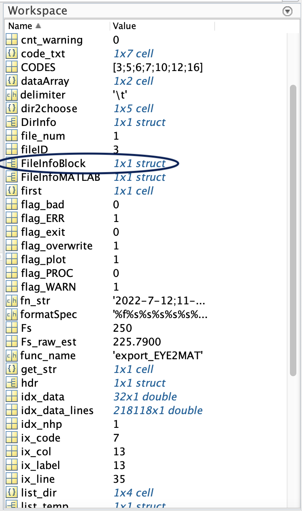
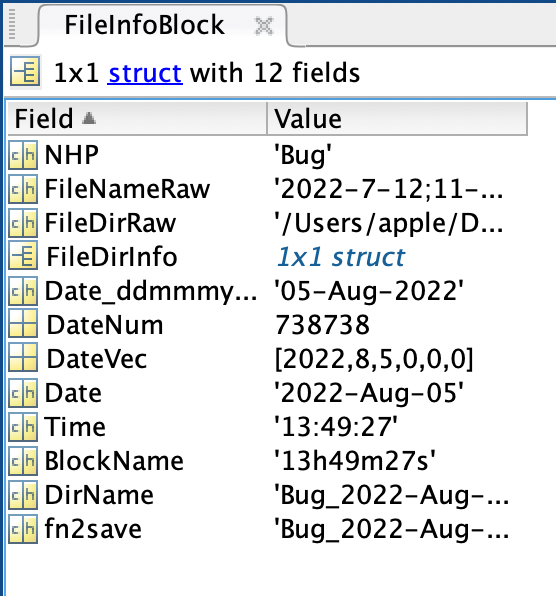
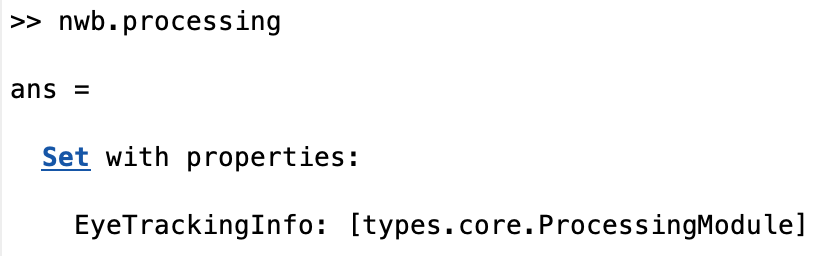
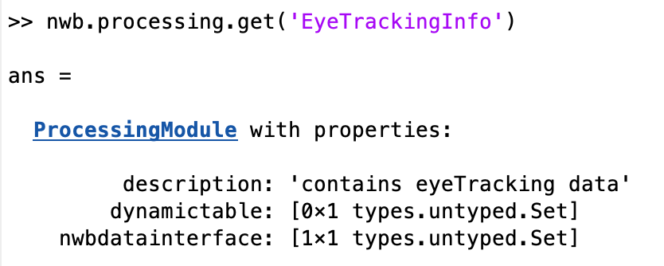
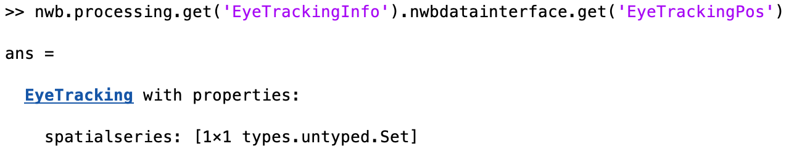
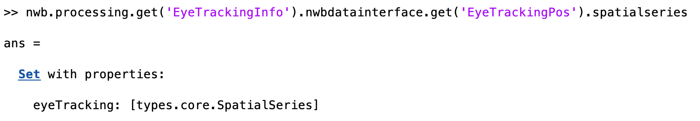
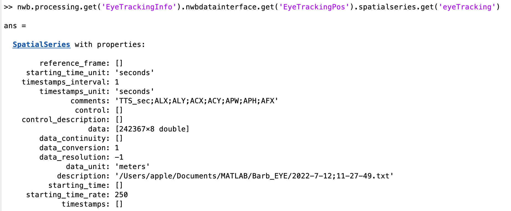
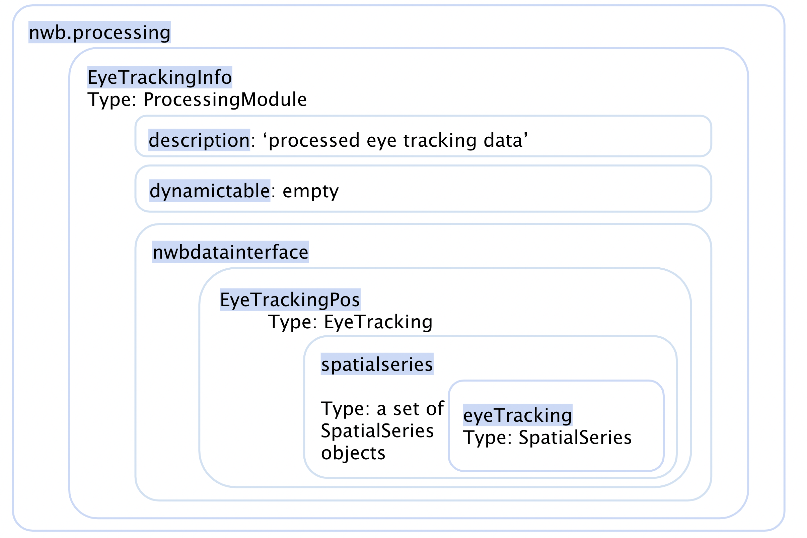

-------------------
Eye Tracking System
-------------------

Structure of Eye Tracking System
-----------------------------------

Input File containing raw eye tracking data is required in order to store information into NWB Structure
"""""""""""""""""""""""""""""""""""""""""""""""""""""""""

+---------------+---------------------------------------------------------------------+
|      File     |                       Description                                   |
+===============+=====================================================+===============+
|               | Processed eye tracking data in txt format                           |
|  ``*``.txt    |                                                                     |
|               | Can be read with function readcell() and readtable() in matlab      |
+---------------+---------------------------------------------------------------------+

Note: TrialDataEye and FileInfoBlock are needed to store eye tracking data into NWB format.

Steps to get TrialDataEye and FileInfoBlock from raw eye tracking data file
"""""""""""""""""""""""""""""""""""""""""""""""""""""""""""""""""""""""""""""""""
1. Click the Run button at the top of the screen.

.. image:: figures/systemeyetracking_runbutton.png

2. A Menu window with NHPs' names will pop up. Click the name of the NHP you are working with.

.. image:: figures/systemeyetracking_menu.png

3. A window with different sessions will pop up. Click the one you want to work on, then click the OK button at the bottom of the window.

.. image:: figures/systemeyetracking_choosesession.png

4. Wait until the program finish saving the file. 

You can find FileInfoBlock and TrialDataEye in the Workspace section at the right of the screen.

.. image:: figures/systemeyetracking_trialdataeye1.png

Various kinds of information are stored in the FileInfoBlock and TrialDataEye objects.

* TrialDataEye 
  contains all eyetracking data across all timestamps

* FileInfoBlock 
  contains all descriptive information of the data
          
You can view them in detail by clicking it.

.. image:: figures/systemeyetracking_trialdataeye2.png

After extracting TrialDataEye and FileInfoBlock using export_EYE2MAT.m, store useful information into NWB structure.

NWB Structure Storing processed Eye Tracking Data
------------------------------------------

Layer1:
-----
Processed Eye Tracking data, along with other types of data, are stored inside nwb.processing:
``nwb.processing``

Layer2:
-----
The ProcessingModule inside nwb.processing named EyeTrackingInfo is where we stored processed eye tracking data.
You can find a description and a nwbdatainterface inside.
``nwb.processing.get('EyeTrackingInfo')``

Layer3:
----- 
``nwb.processing.get('EyeTrackingInfo').nwbdatainterface``

.. image:: figures/systemeyetracking_layer3.png

Layer4:
----- 
This EyeTracking object contains a set of spatialseries objects.
``nwb.processing.get('EyeTrackingInfo').nwbdatainterface.get('EyeTrackingPos')``

Layer5:
----- 
Get the set of spatialseries objects with the command below.
``nwb.processing.get('EyeTrackingInfo').nwbdatainterface.get('EyeTrackingPos').spatialseries``

Layer6:
----- 
Inside the set of spatialseries objects, we stored processed eye tracking data inside the spatialseries object named 'eyeTracking'.
``nwb.processing.get('EyeTrackingInfo').nwbdatainterface.get('EyeTrackingPos').spatialseries.get('eyeTracking')``

Notes:

* spatialseries.comments: 
          Data Type: character
	Appropriate column names for eye tracking data delimited with ``;``

* spatialseries.data: 
          Data Type: Double Array
 	All eyetracking data across all timestamps
          
* spatialseries.starting_time_rate:
          Data Type: Double
  	Number of timestamps recorded in one second
	

Structure inside nwb.processing
"""""""""""""""""""""""""""""""""""""""""""          

